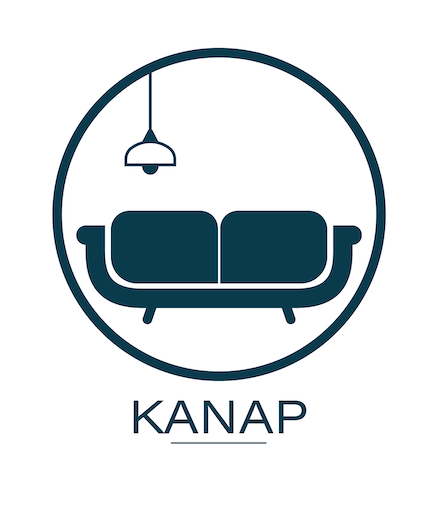

# Formation Dev Web - Projet 5 - Kanap

## Kanap : catalogue de canapés en ligne
<p align="center">
  
</p>

### Scénario

Vous êtes en poste dans une agence de développement web depuis quelques semaines maintenant. Après avoir réalisé avec succès l’intégration de quelques sites web (HTML/CSS), on vous confie une nouvelle mission.

Votre client est Kanap, une marque de canapés qui vend ses produits depuis sa boutique exclusivement. Aujourd’hui, celle-ci souhaiterait avoir une plateforme de e-commerce en plus de sa boutique physique pour vendre ses produits sur Internet.

Dans le cadre de cette mission, vous travaillez avec une équipe constituée de :

Corinne, le CTO de l’agence ;
Frank, le développeur front-end qui s’est chargé d’intégrer la maquette statique du site ;
Bilal, le développeur back-end qui implémente l’API à laquelle est connecté le front-end.


### Mission
Voici les différentes tâches que tu vas devoir mener à bien :

- Unifier les travaux déjà réalisés par l’équipe en intégrant dynamiquement les éléments de l’API dans les différentes pages web avec JavaScript. Le code du front-end et de l’API est déjà disponible. Pour ce projet, vous ne pouvez utiliser que du code JavaScript pur.
- Mettre en place un plan de test d’acceptation à partir de ce template que nous avons pour habitude d’utiliser.

## Installation du projet
### Backend
Le dossier back permet de faire tourner l'api contenant les données des produits.

#### Installation
Il suffit de se positionner dans le dossier backend avec un terminal et de saisir la commande npm install

#### Lancement du serveur
Il suffit de se positionner dans le dossier backend avec un terminal et de saisir la commande node start Par défaut le serveur sera lancé sur le port 3000 ( http://localhost:3000 )

#### Route api
Il y a 3 routes disponibles sur le serveur :

##### GET /api/products/
Permet de récupérer l'ensemble des produits disponibles

##### GET /api/products/{id}
{id} : identifiant unique d'un produit Permet de récupérer un produit par son identifiant

##### POST /api/products/order
Envoie une commande pour l'enregistrer La commande envoyé doit être au format JSON suivant :


```JS
  {
      contact{
        firstName: <string>,
        lastName: <string>,
        address: <string>,
        city; <string>,
        email: <string>
    },
    products: [<string>]
  }
```
products étant un tableau d'id produit.

#### Frontend
Le frontend présente la partie utilisateur de l'application. Il doit être lancé avec un serveur local (live server avec vscode par exemple), et nécessite que le backend soit lancé lui aussi pour fonctionner correctement.

##### Config
Le fichier de config permet de définir l'adresse de base du server, avec son host, port et si un certificat ssl est utilisé ou non.

### Compétences développées et stack utilisée

    💹 Valider des données issues de sources externes
    💹 Gérer des événements JavaScript
    💹 Créer un plan de test pour une application
    💹 Interagir avec un web service avec JavaScript
